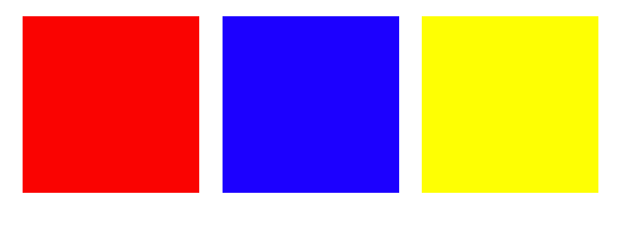
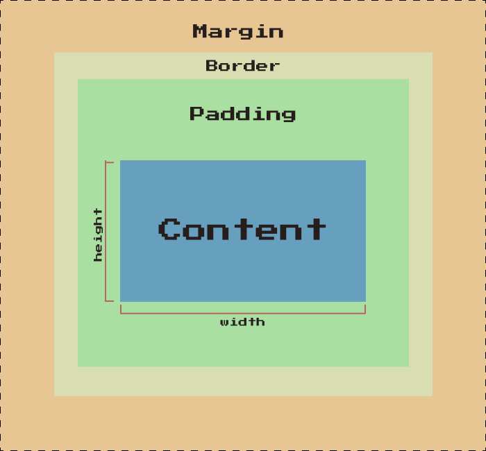
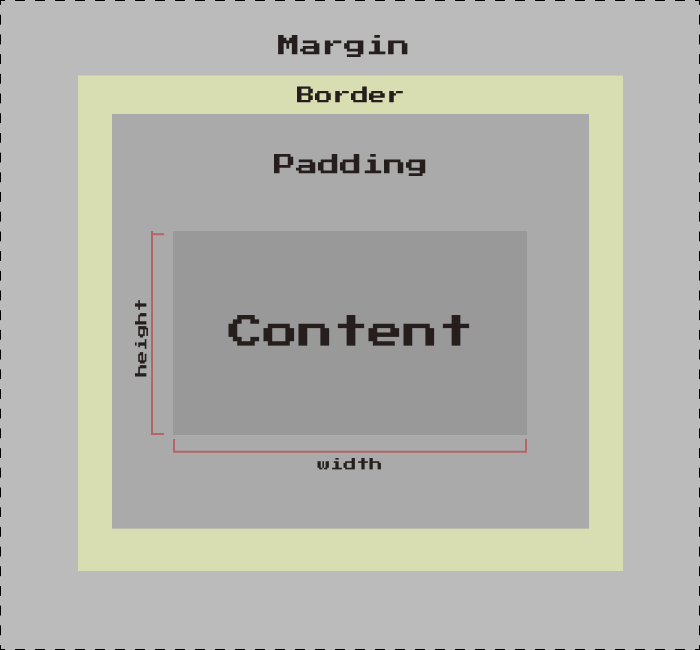
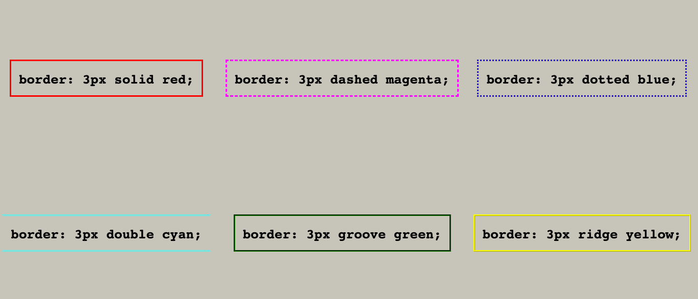
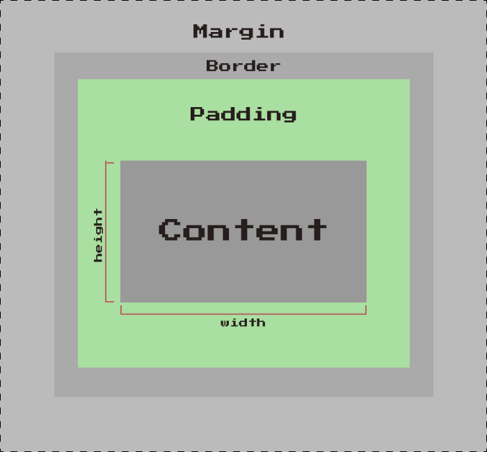
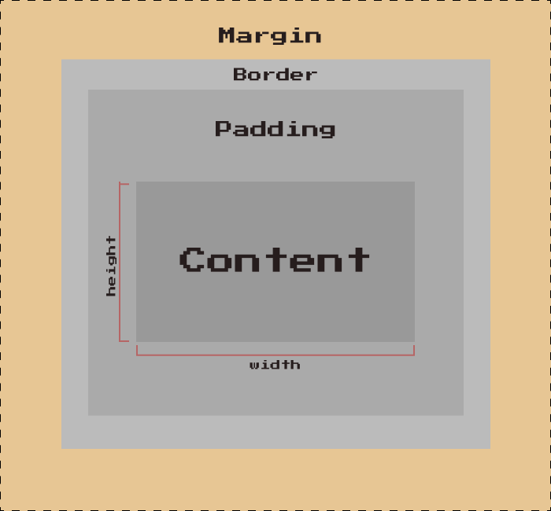
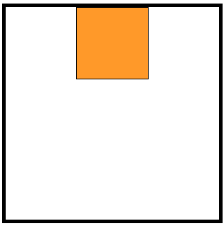
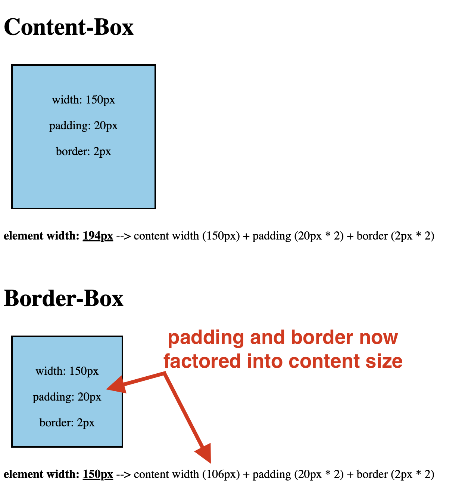
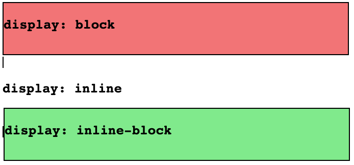

# The Origins II: CSS

## Rule Syntax
*01_Picasso*

**Rules** – How the elements should be styled on our page


Every rule begins with a **selector**, followed by curly brackets ``{ }``

**Declarations** are made of ``property:value`` pairs separated by a colon. Each line ends with a ``;`` semicolon.

## Selectors (part 1)
*02_Syntax*

### Type Selectors
Which selects all matching elements on the page for styling

    div {
        /* Styles go here. */
    }

### Class and ID Selectors
The following example selects elements with a ``class`` of ``"class-name"`` or an ``id`` of ``"id-name"``:

    .class-name {
        /* Styles go here. */
    }

    #id-name {
        /* Styles go here. */
    }

- Selecting by class is done with a ``.`` period, and used to style multiple elements with a matching class attribute.
- Selecting by id is done with a ``#`` hashtag, and used to style a single element with a matching id attribute.

        div.class-name {
            /* Styles go here. */
        }

        div#id-name {
            /* Styles go here. */
        }

Rather than selecting every element with a matching class or id, the example above selects only div elements that either have a class of ``"class-name"`` or an id of ``"id-name"``.

This specific kind of selection is also known as **targeting**.

### Groupings

Long version:

    ul {
        border: 1px solid;
        width: 50px;
    }

    ol {
        border: 1px solid;
        width: 50px;
    }

Short version:

    ul, ol {
        border: 1px solid;
        width: 50px;
    }

### Combining

We can also get more specific by using the ``>`` symbol to select child elements, such as only ``<li>`` elements under unordered lists:

    ul > li {
        border: 1px solid;
        width: 50px;
    }

## Colors

### ``Color`` property

Using English words:

    p {
    color: red;
    }

Supports 140 colors (https://www.w3schools.com/cssref/css_colors.php)

### RGB

Represents the intensity of the red-ness, green-ness, and blue-ness of the color(s) that we assign to a given element.

``rgb()`` function accepts three integers ranging from 0 to 255 (0 has no intensity and 255 has maximum intensity), and is assigned to the color property:

    color: rgb(255, 0, 0);     /* Red */

    color: rgb(0, 255, 0);     /* Green */

    color: rgb(0, 0, 255);     /* Blue */

Alternatively, it can be expressed with hexadecimals that begin with a hashtag ``#``, followed by a combination of numbers (0-9) and letters (a-f):

    color: #ff0000;    /* Red */

    color: #008000;    /* Green */

    color: #0000ff;    /* Blue */

## Measurements

### Sizing

```` element has a default ``width`` and ``height`` set to the original size of the image.

    img {
        width: 250px;
        height: 400px;
    }

### Absolute vs. Relative Units

**Absolute Units**
Are usually expressed as numbers, with or without a decimal. They are fixed and do not change in size according to the size of its direct parent element.

- Pixelss ``px``
- Points ``pt``
- Centimeters ``cm``

*Note: Be mindful of setting the ``height`` of a given element with absolute units, as it may cause the content to overflow outside the boundaries of its parent element.*

**Relative Units**

If we set an element's property with relative units, it will change if the size of something else changes, like its parent element or the computer screen itself!

- Percentage ``%``
- ``em`` measurements that are associated with the font size of either the parent element when applying font-size or the element itself when setting the width.
    - Uses may include setting a page's text to change according to how a user sets the text size for their browser.
- ``rem`` measurements that are associated with the font size of the root ``<html>`` element (16pt, by default).
    - Could be used to set the baseline text size for their site.

## CSS Fonts

Five generic font families:

1. Serif
2. Sans-serif
3. Monospace
4. Cursive
5. Fantasy

| Font Family | Characteristics | Examples |
|---|---|---|
| Serif       | Small decorative strokes added to the ends of letters, often used for printed materials because they are more legible. | Georgia, Times New Roman, Baskerville |
| Sans-serif  | No strokes at the ends of letters, often used in digital media and advertising for a modern and professional look. | Arial, Helvetica Neue, Open Sans |
| Monospace   | Each character takes up the same amount of horizontal space, often used for computer programming. | Consolas, Courier New, Lucida Console |
| Cursive     | Has a hand-written appearance, often used for printed materials that convey a personal touch. | Brush Script MT, Lobster, Dancing Script |
| Fantasy     | Highly stylized or decorative letter forms, often used to add personality and flair to a design or display. | Impact, Chiller, Jokerman |

To assign these families with CSS, we use the font-family property:

    p {
        font-family: Arial, sans-serif;
    }

*Note: It is good practice to always include a general font name after the desired font name.*

### Font Properties

**``font-size``**

- ``font-size`` property sets how big the text of a given element should be on the page. It can either be done with absolute units (``px``, ``pt``, etc.) or relative units (percentages, ``em``, ``rem``, etc.)

    /* With Absolute Units */
    p {
        font-size: 12px;
    }

    /* With Relative Units */
    p {
        font-size: 12em;
    }

<div style="text-align: center;">
    
</div>

*Note: The font-size property should be applied in an accessible way. This means avoiding absolute units when possible and not making paragraph text as large as header text (or vice versa).*

**``font-weight``**

- ``font-weight`` property to set the default "thickness" of a given element's text.

- This property uses either keyword values (e.g., ``lighter`` and ``bolder``), or numeric values (e.g., 100 and 800)

If we use numeric values for the ``font-weight`` property, keep the following in mind:
- Anything less than 400 makes the font thinner or lighter.
The 400-700 range is considered "normal" for most fonts.
- Anything above 700 usually makes the font bolder.

## Alignment

- Text-based content may align its text in certain ways to make it more readable and user-friendly.

- ``text-align``

        #left-align {
            text-align: left;
        }

        #center-align {
            text-align: center;
        }

        #right-align {
            text-align: right;
        }

<div style="text-align: center;">
    
</div>

## Decoration

``text-decoration``

## Background Color

- ``background-color`` is different from ``color``

        /* With named colors */
            div {
            background-color: red;
        }

        /* With rgb() function */
            div {
            background-color: rgb(0, 0, 255);
        }

        /* With hexadecimals */
            div {
            background-color: #ffff00;
        }

<div style="text-align: center;">
    
</div>


## Background Image

``background-image``

        div {
            background-image: url('https://cdn.pixabay.com/photo/2017/08/10/19/13/city-skyline-2626619_960_720.jpg');
        }

- ``url()`` function that accepts a URL or file path to an image.
- ``background-size`` to change the background image size.
- ``background-size: contain;`` this scales the image to fit the container and not crop it; the ``cover`` value will crop the image.
- ``background-repeat`` property will repeat the image, followed by the ``no-repeat`` option otherwise.

## Shorthands

``border``

    span {
        border-width: 3px;
        border-style: dashed;
        border-color: #ff0000;
    }
    
    span {
        border: 3px dashed #ff0000;
    }

Long version:

    span {
        font-family: Georgia, serif;
        font-weight: 800;
        font-size: 12px;
    }

Short version:

    span {
        font: 800 12px Georgia, serif;
    }

**The shorthand ``font`` property must at least have a value for the ``font-family`` and ``font-size`` properties.** *Everything else is optional, but the font-weight must go before the font-size (e.g., 800 12px).*

## Box Model

*Everything* on a web page is in a box. Every element on a page follows the box model.

<div style="text-align: center;">
    
</div>

Box Model: Inner to Outer

1. A **content box** for things like text and images.
2. A **padding box** of space around the content.
3. A **border box** that goes around the padding.
4. A **margin box** of empty space that surrounds the whole element.

Go to the course page for The Origins II: CSS: https://www.codedex.io/css

Find the box model in your browser's dev tools:

- Google Chrome: Right-click > "Inspect" > "Computed" tab.
- Safari: "Safari" > "Settings" > "Advanced" tab > "Show features for web developers" (near the bottom). Now click "Develop" > "Show Web Inspector".

## Border Box

<div style="text-align: center;">
    
</div>

- Uses ``border`` property

        /* Both of these are the same */

        h1 {
            border: 2px solid blue;
        }

        h1 {
            border-width: 2px;
            border-style: solid;
            border-color: blue;
        }

- ``border-width`` determines the "thickness" of the border, and is usually set with absolute units (e.g., pixels).
- ``border-style`` includes values like solid, dashed, dotted.
- ``border-color`` can be set with a named color, an rgb() value, or a hexadecimal

<div style="text-align: center;">
    
</div>

### Border Styling Properties

``border-top``, ``border-right``, ``border-bottom`` ``border-left``


    h1 {
        border-top: 5px dashed red;
        border-right: 5px dotted purple;
        border-bottom: 5px double yellow;
        border-left: 5px solid green;
    }

### Round Corners

- Uses ``border-radius`` property

        h1 {
            border: 2px solid blue;
            border-radius: 5px;
        }

## Padding Box

<div style="text-align: center;">
    
</div>

- Uses ``padding`` property

      padding: 40px;

- You can separate the values:

        padding-top: 5px;
        padding-right: 10px;
        padding-bottom: 15px;
        padding-left: 20px;

- Or shorthand them:

        padding: 5px 10px 15px 20px;

- Order is top, right, bottom, left.

## Margin Box

<div style="text-align: center;">
    
</div>

- Uses ``margin`` property

        margin: 40px;

- You can separate the values:

        margin-top: 20px;
        margin-right: 10px;
        margin-bottom: 20px;
        margin-left: 10px;

- Like the ``padding`` and ``border`` properties, ``margin`` is a shorthand for each side of the element:

        margin: 20px 10px 20px 10px;

## Centering Content

- You can *horizontally center* elements with the ``margin`` property, using ``auto``.

- Always set a ``width`` property to the element you want to center.

        `#container-element {
            width: 300px;
            height: 300px;
            border: 3px solid;
        }

        #inner-element {
            width: 100px;
            height: 100px;
            border: 1px solid;
            background-color: orange;
            margin: auto;
        }

<div style="text-align: center;">
    
</div>

## Content Box vs. Border Box

- By default, an element's width and height properties only deal with the content box. But if there's any padding around the content, or a border, the entire element appears wider on the page.

- The ``box-sizing`` property tells our website how to calculate the ``width`` and ``height`` properties of a given element.

To explain the difference:

    #content-box {
        text-align: center;
        background-color: skyblue;
        width: 150px;
        height: 150px;
        padding: 20px;
        border: 2px;
    }

    #border-box {
        text-align: center;
        background-color: skyblue;
        width: 150px;
        height: 150px;
        padding: 20px;
        border: 2px;
        box-sizing: border-box;
    }

<div style="text-align: center;">
    
</div>

- The default value is ``content-box``, which adds the ``padding`` and border values to the final ``width`` of the element.
- However, we can switch this to ``border-box``, and make it so that ``padding`` and border are included in the final width, and the element maintains its expected size.

In the element under “Border Box”, the ``padding`` and ``border`` are factored in the content ``width``. Therefore, the size of the content box will change to maintain that ``150px`` width.

## Lines & Blocks

### Displaying Elements

- Some elements would be written on their own line.
- Other elements would be able to share a line with other elements.

#### Blocks

**Block** elements take up the entire ``width`` of whatever they're inside of. However, this can be changed (as well as the ``height``).

- By default, block elements are rendered on their own line by themselves.
- The ``<div>`` and ``<p>`` elements are common block elements. Each element is displayed on its own line.

#### Lines

**Inline** elements only take up as much space as needed, and other elements may appear beside them! The ``<a>`` anchor element is a very popular inline element because links are always being used within blocks of text (e.g., a Wikipedia article with lots of links to other places).
- If we wanted to change the default display of these elements, we would use the display property!

        a {
            display: block;
        }

***Note: Unlike block elements, inline elements cannot change their width or height properties.***

When you set an element to display: ``inline-block``, you get the best of both worlds:
- It can share the same line with other inline elements.
- Despite being inline, its width and height can be changed.

        #block {
            background-color: lightcoral;
            height: 100px;
        }

        #inline {
            background-color: lightblue;
        }

        #inline-block {
            background-color: lightgreen;
        }

<div style="text-align: center;">
    
</div>

*Note: As shown above, some elements, like the ``<div>`` element, behave weirdly when set to just inline. Any content inside remains, but the width and height of the ``<div>`` are practically not there anymore.*

## Normal Flow of Elements

When elements are displayed on the screen, they will appear as close to the top and left edges of their parent elements as possible. They will also appear either as blocks or inline elements.

This is known as the **normal flow of elements.**

Uses ``position`` property, where ``static`` is the default.

    position: static;

*Not necessary to use since it is a default.*

## Relative

The ``relative`` position allows your element to be "moved" around the screen, away from where it would normally be on the screen.

    position: relative;

When we set an element's position property to anything but static, it can be moved with the ``top``, ``right``, ``bottom``, and ``left`` properties. This includes relative.

- The ``top`` and ``left`` properties can also be set with relative units like 5em and 50%.

***Note***: Keep in mind that ``top`` moves an element down the screen, ``right`` moves it to the left, ``bottom`` moves it up, and ``left`` moves it right. Imagine something is pushing the element box from that side (i.e., push the element 25px to the right from the left side).

## z-index

If you work with ``position: relative`` long enough, you'll notice how some elements will overlap other elements.

When you don't want this, try using the ``z-index`` property! This changes the way elements are "layered" on the site, regardless of when they appear on the HTML file.

## Absolute

If we position an element with ``absolute``, we break it out of the page's flow. If we then give the element a ``top``, ``right``, ``bottom``, and/or ``left`` property, it is placed according to the top-left of its closest non-static element.

    position: absolute;

## Fixed

The ``fixed`` position works similar to ``absolute`` by taking an element out of the normal flow of the page. However, fixed elements stay where they are placed on the screen even when you scroll up and down of the page.

    position: fixed;

## Sticky

The ``sticky`` option keeps the element in flow with the other elements. As you scroll the page, the element will stay in its normal spot until it is a certain distance from the top of its containing element (after which it will stick to a place).

    position: sticky;