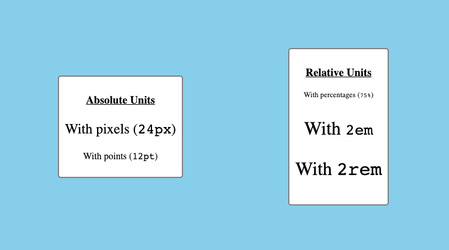
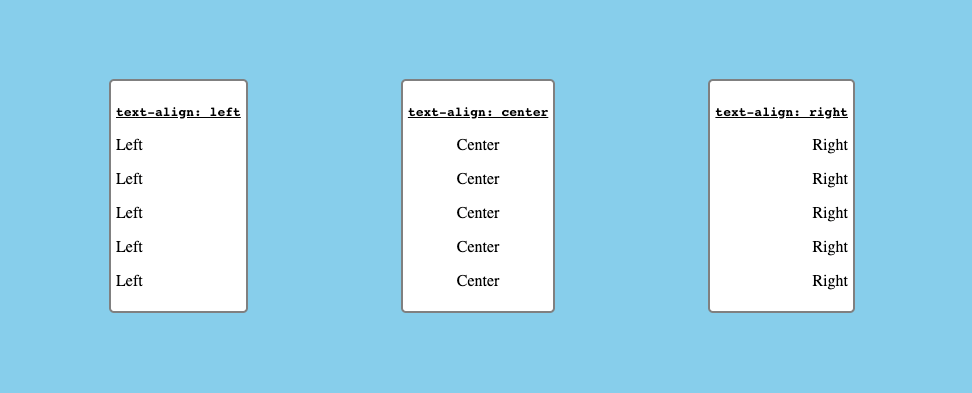

# The Origins II: CSS

## Rule Syntax
*01_Picasso*

**Rules** – How the elements should be styled on our page


Every rule begins with a **selector**, followed by curly brackets ``{ }``

**Declarations** are made of ``property:value`` pairs separated by a colon. Each line ends with a ``;`` semicolon.

## Selectors (part 1)
*02_Syntax*

### Type Selectors
Which selects all matching elements on the page for styling

    div {
        /* Styles go here. */
    }

### Class and ID Selectors
The following example selects elements with a ``class`` of ``"class-name"`` or an ``id`` of ``"id-name"``:

    .class-name {
        /* Styles go here. */
    }

    #id-name {
        /* Styles go here. */
    }

- Selecting by class is done with a ``.`` period, and used to style multiple elements with a matching class attribute.
- Selecting by id is done with a ``#`` hashtag, and used to style a single element with a matching id attribute.

        div.class-name {
            /* Styles go here. */
        }

        div#id-name {
            /* Styles go here. */
        }

Rather than selecting every element with a matching class or id, the example above selects only div elements that either have a class of ``"class-name"`` or an id of ``"id-name"``.

This specific kind of selection is also known as **targeting**.

### Groupings

Long version:

    ul {
        border: 1px solid;
        width: 50px;
    }

    ol {
        border: 1px solid;
        width: 50px;
    }

Short version:

    ul, ol {
        border: 1px solid;
        width: 50px;
    }

### Combining

We can also get more specific by using the ``>`` symbol to select child elements, such as only ``<li>`` elements under unordered lists:

    ul > li {
        border: 1px solid;
        width: 50px;
    }

## Colors

### ``Color`` property

Using English words:

    p {
    color: red;
    }

Supports 140 colors (https://www.w3schools.com/cssref/css_colors.php)

### RGB

Represents the intensity of the red-ness, green-ness, and blue-ness of the color(s) that we assign to a given element.

``rgb()`` function accepts three integers ranging from 0 to 255 (0 has no intensity and 255 has maximum intensity), and is assigned to the color property:

    color: rgb(255, 0, 0);     /* Red */

    color: rgb(0, 255, 0);     /* Green */

    color: rgb(0, 0, 255);     /* Blue */

Alternatively, it can be expressed with hexadecimals that begin with a hashtag ``#``, followed by a combination of numbers (0-9) and letters (a-f):

    color: #ff0000;    /* Red */

    color: #008000;    /* Green */

    color: #0000ff;    /* Blue */

## Measurements

### Sizing

```` element has a default ``width`` and ``height`` set to the original size of the image.

    img {
        width: 250px;
        height: 400px;
    }

### Absolute vs. Relative Units

**Absolute Units**
Are usually expressed as numbers, with or without a decimal. They are fixed and do not change in size according to the size of its direct parent element.

- Pixelss ``px``
- Points ``pt``
- Centimeters ``cm``

*Note: Be mindful of setting the ``height`` of a given element with absolute units, as it may cause the content to overflow outside the boundaries of its parent element.*

**Relative Units**

If we set an element's property with relative units, it will change if the size of something else changes, like its parent element or the computer screen itself!

- Percentage ``%``
- ``em`` measurements that are associated with the font size of either the parent element when applying font-size or the element itself when setting the width.
    - Uses may include setting a page's text to change according to how a user sets the text size for their browser.
- ``rem`` measurements that are associated with the font size of the root ``<html>`` element (16pt, by default).
    - Could be used to set the baseline text size for their site.

## CSS Fonts

Five generic font families:

1. Serif
2. Sans-serif
3. Monospace
4. Cursive
5. Fantasy

| Font Family | Characteristics | Examples |
|---|---|---|
| Serif       | Small decorative strokes added to the ends of letters, often used for printed materials because they are more legible. | Georgia, Times New Roman, Baskerville |
| Sans-serif  | No strokes at the ends of letters, often used in digital media and advertising for a modern and professional look. | Arial, Helvetica Neue, Open Sans |
| Monospace   | Each character takes up the same amount of horizontal space, often used for computer programming. | Consolas, Courier New, Lucida Console |
| Cursive     | Has a hand-written appearance, often used for printed materials that convey a personal touch. | Brush Script MT, Lobster, Dancing Script |
| Fantasy     | Highly stylized or decorative letter forms, often used to add personality and flair to a design or display. | Impact, Chiller, Jokerman |

To assign these families with CSS, we use the font-family property:

    p {
        font-family: Arial, sans-serif;
    }

*Note: It is good practice to always include a general font name after the desired font name.*

### Font Properties

**``font-size``**

``font-size`` property sets how big the text of a given element should be on the page. It can either be done with absolute units (``px``, ``pt``, etc.) or relative units (percentages, ``em``, ``rem``, etc.)

    /* With Absolute Units */
    p {
        font-size: 12px;
    }

    /* With Relative Units */
    p {
        font-size: 12em;
    }



*Note: The font-size property should be applied in an accessible way. This means avoiding absolute units when possible and not making paragraph text as large as header text (or vice versa).*

**``font-weight``**

``font-weight`` property to set the default "thickness" of a given element's text.

This property uses either keyword values (e.g., ``lighter`` and ``bolder``), or numeric values (e.g., 100 and 800)

If we use numeric values for the ``font-weight`` property, keep the following in mind:
- Anything less than 400 makes the font thinner or lighter.
The 400-700 range is considered "normal" for most fonts.
- Anything above 700 usually makes the font bolder.

## Alignment

Text-based content may align its text in certain ways to make it more readable and user-friendly.

``text-align``

    #left-align {
        text-align: left;
    }

    #center-align {
        text-align: center;
    }

    #right-align {
        text-align: right;
    }



## Decoration

``text-decoration``

